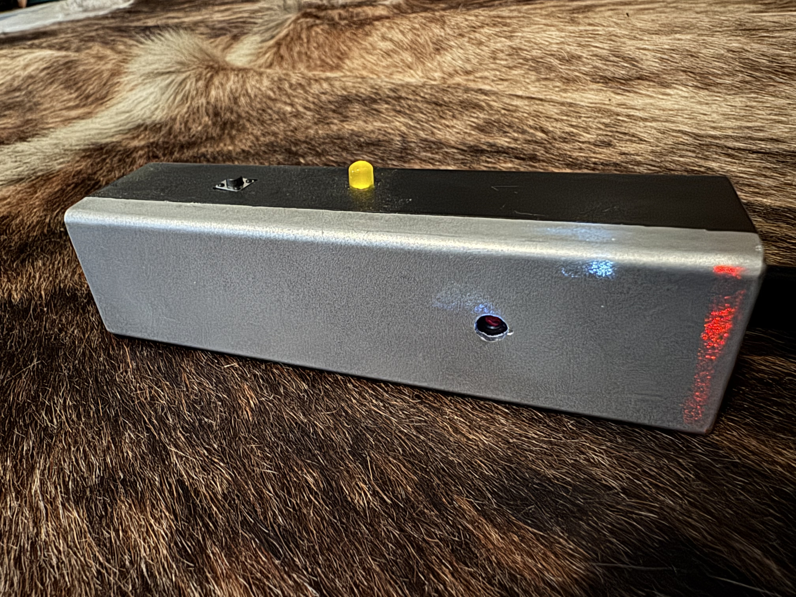
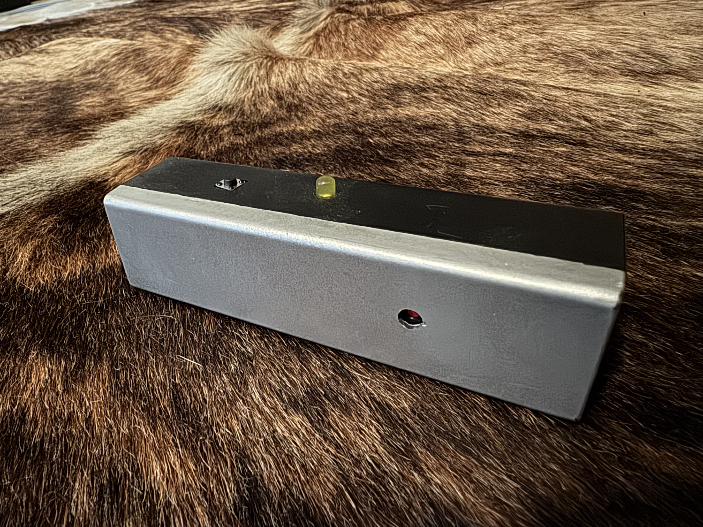
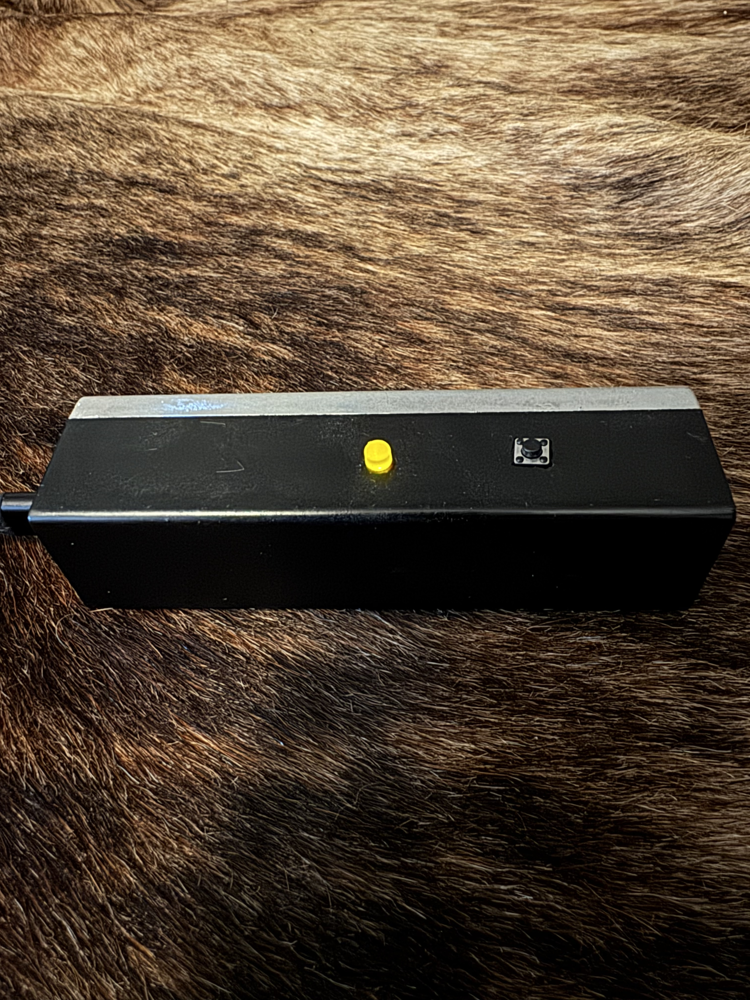
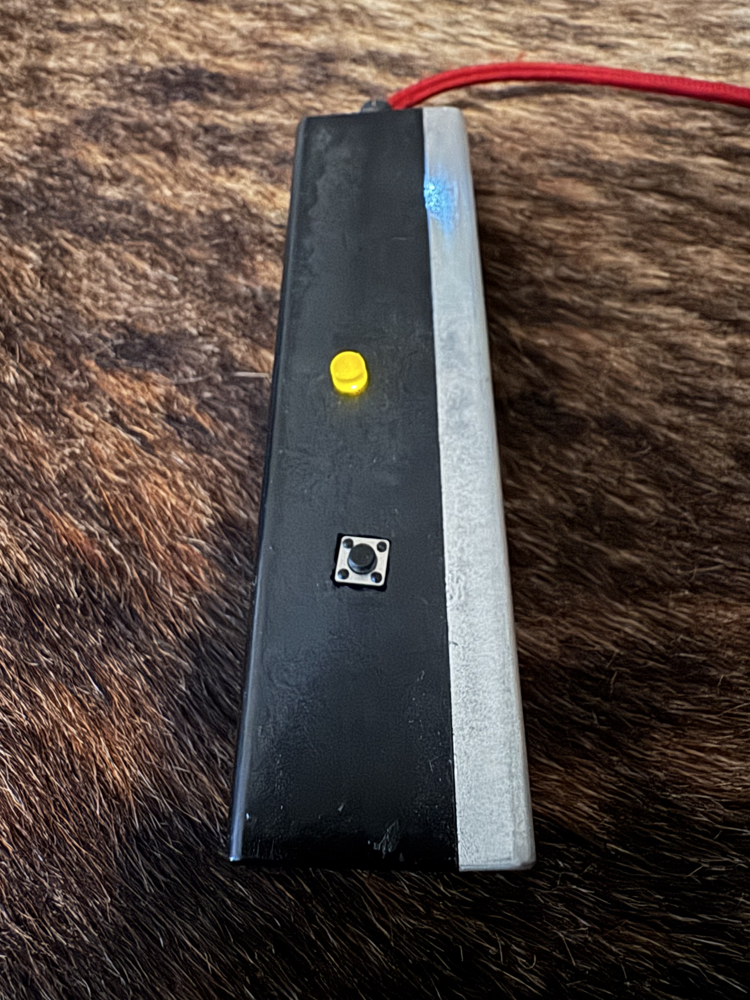
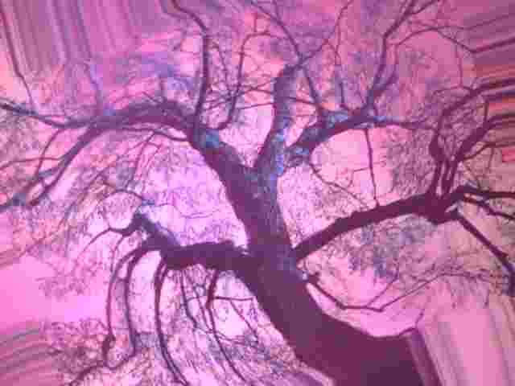
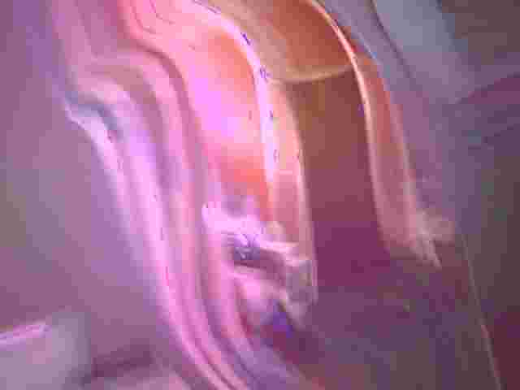
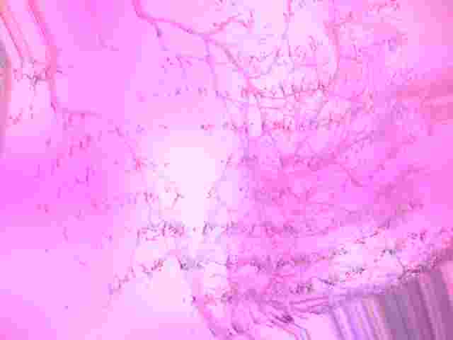
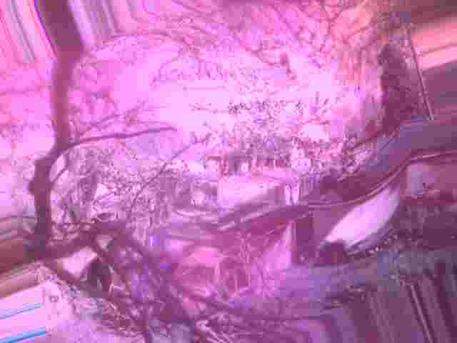
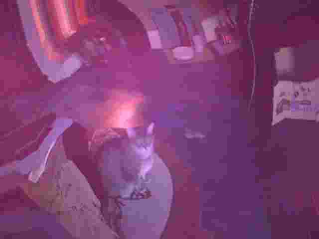

# Veil

<p align="center">
  
</p>

<p align="center">
  
  
  
</p>

Veil is a handheld ESP32-CAM image capture device.

It captures an image, processes it immediately, and saves only the processed result to microSD.

The original unprocessed image is discarded.

The project was built around the idea of intentionally distorting captured images through layered transformations to create unpredictable visual artifacts.

Current image processing includes:

- warping
- shear distortion
- swirl transforms
- drift fields
- chromatic shifts
- haze grading
- glow extraction
- blur blending
- vignette falloff

Each capture applies these effects using randomized parameters and entropy from the ESP32.

---

## Sample Captures

<table align="center">
<tr>
<td></td>
<td></td>
<td></td>
</tr>
<tr>
<td></td>
<td></td>
<td></td>
</tr>
</table>

---

## Use

Press the hardware button to trigger a capture.

The image is:

1. captured from the camera  
2. converted from RGB565 to RGB888  
3. processed through the Veil pipeline  
4. compressed to JPEG  
5. saved to microSD  

Veil hosts a local Wi-Fi archive for reviewing stored captures.

```text
SSID: VeilCam
PASS: veilveilveil
```

Open:

```text
http://192.168.4.1
```

From the web UI you can:

- trigger captures
- browse saved images
- view status

---

## Hardware

Current build uses:

- AI Thinker ESP32-CAM  
- microSD storage  
- momentary trigger button  
- onboard flash LED (GPIO4)  
- repurposed disposable vape packaging enclosure  

More detailed hardware and wiring documentation is in `/docs`.

---

## Technical Notes

- Images are captured in RGB565 for direct pixel processing.
- Final output is encoded as JPEG.
- Current frame size is QVGA (320x240) for memory stability.
- GPIO4 shares the flash LED circuit and must remain high-impedance during capture to prevent framebuffer failures.
- Image filenames are stored sequentially using ESP32 Preferences.

---

## Repo Structure

```text
Veil/
├── README.md
├── firmware/
│   └── veil.ino
├── docs/
│   ├── HARDWARE.md
│   ├── WIRING.md
│   └── SOFTWARE.md
└── images/
```

---

## License

MIT

---

<p align="center">
  Built under Feral Engineering.
  <br>
  
</p>
